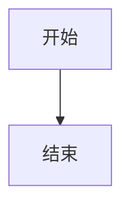

# Yuln 的博客

基于 **React 19 + React Router v7 + Vite 8** 的静态博客。Markdown 编写文章，构建时预渲染为纯静态 HTML，部署到 Vercel 和 Cloudflare Workers。

## 特性

- **Markdown 写作** — YAML frontmatter，markdown-it 渲染，支持 Mermaid 图表
- **构建时渲染** — highlight.js 代码高亮、Mermaid → SVG、sharp 图片压缩转 WebP，全部在构建时完成
- **全文搜索** — MiniSearch 客户端索引，支持前缀匹配和模糊搜索
- **暗色主题** — 无闪烁切换，内联脚本预判 + localStorage 持久化
- **图片查看** — PhotoSwipe 灯箱，支持手势缩放
- **评论系统** — Giscus（GitHub Discussions），自动跟随主题
- **SEO 完备** — 每个页面独立 meta/OG/Twitter Card/canonical，自动生成 RSS、sitemap.xml、robots.txt、llms.txt
- **30+ 单元测试** — 覆盖日期格式化、frontmatter 解析、路径解析、字数统计、搜索文本生成

## 技术栈

| 分类 | 技术 |
|------|------|
| 框架 | React 19、React Router v7（SSR + prerender） |
| 构建 | Vite 8、TypeScript |
| Markdown | markdown-it、YAML（frontmatter） |
| 代码高亮 | highlight.js（构建时） |
| 图表 | mermaid（构建时，jsdom 环境） |
| 安全 | isomorphic-dompurify（HTML 过滤） |
| 搜索 | MiniSearch（客户端） |
| 图片 | PhotoSwipe（灯箱）、sharp（构建时压缩 & WebP） |
| 评论 | Giscus |
| SEO | feed（RSS）、sitemap、robots.txt、llms.txt |
| 测试 | Vitest |
| 部署 | Vercel、Cloudflare Workers |

## 目录结构

```text
app/
├── root.tsx                 # HTML 文档壳（<html>/<head>/<body>）
├── routes.ts                # 路由配置
├── layout.tsx               # 页面布局（导航栏 + 页脚 + 回顶按钮）
└── routes/
    ├── home.tsx             # 首页 /
    ├── posts.tsx            # 文章列表 /posts（复用首页组件）
    ├── post-detail.tsx      # 文章详情 /posts/:slug
    ├── archives.tsx         # 归档 /archives
    ├── search.tsx           # 搜索 /search
    └── not-found.tsx        # 404

lib/                         # 共享逻辑（route loader 与构建脚本共用）
├── posts-loader.ts          # 文章加载、markdown 渲染
├── text-utils.ts            # 纯文本处理、字数统计
└── mermaid-renderer.ts      # 构建时 Mermaid → SVG

src/
├── config.ts                # 站点配置（URL、标题、Giscus 等）
├── content/posts/           # Markdown 文章（每个 slug 一个目录）
├── components/
│   ├── article/             # ArticleHeader、ImageViewer、PostToc
│   ├── comment/             # Giscus
│   ├── common/              # ErrorBoundary、PaperPostList
│   ├── layout/              # NavBar、SiteFooter、BackToTop
│   └── search/              # SearchHighlight
├── utils/                   # 工具函数 + 测试
├── styles/                  # CSS（theme、base、layout、markdown、components）
└── types/                   # TypeScript 类型定义

scripts/
├── generate-static.ts       # 生成 RSS、sitemap、robots.txt、llms.txt、_headers
└── optimize-images.ts       # 图片压缩 + WebP 转换（带缓存）
```

## 快速开始

```bash
pnpm install
pnpm run dev
pnpm run check
pnpm run test
```

## 写文章

### 创建新文章

在 `src/content/posts/` 下新建一个以 slug 命名的目录，里面放 `index.md`：

```text
src/content/posts/hello-world/
└── index.md
```

### Frontmatter

每篇文章顶部用 YAML 声明元数据：

```yaml
---
title: "你好，世界"
published: 2026-07-28
pinned: false
description: "这是我的第一篇文章。"
image: ""
toc: true
draft: false
---
```

| 字段 | 必填 | 说明 |
|------|------|------|
| `title` | 是 | 文章标题 |
| `published` | 是 | 发布日期（YYYY-MM-DD） |
| `pinned` | 否 | 置顶，默认 `false` |
| `description` | 否 | 文章摘要，用于列表和 SEO |
| `image` | 否 | 封面图 URL（相对路径会自动转为绝对路径） |
| `toc` | 否 | 是否显示目录，默认不显示 |
| `draft` | 否 | 草稿，设为 `true` 时构建和列表都不会包含此文 |

### 插入图片

把图片放在文章目录里，Markdown 中用相对路径引用：

```markdown

```

构建时会自动：
- 将相对路径转为 `/posts/<slug>/img/screenshot.png`
- 为光栅图片（png/jpg/jpeg）生成 WebP 版本，并在 HTML 中插入 `<picture>` 标签做兼容

### Mermaid 图表

用 Markdown 代码块写，语言标注为 `mermaid`：

````markdown

````

构建时 jsdom 环境预渲染为 SVG，客户端无需加载 Mermaid 库。

### 代码高亮

用标准 Markdown 代码块，highlight.js 会在构建时着色：

````markdown
```typescript
const hello = (name: string) => `Hello, ${name}!`;
```
````

### 草稿

设置 `draft: true` 后，该文章不会出现在文章列表、归档、搜索和 RSS 中，也无法通过 URL 直接访问。开发模式下可正常预览。

## 构建

```bash
pnpm run build
```

构建分为三个阶段：

1. **react-router build** — 预渲染所有路由（含 `.data` 文件用于客户端导航）
2. **optimize-images** — 压缩光栅图片、生成 WebP 副本（`.image-cache/` 缓存避免重复处理）
3. **generate-static** — 生成 RSS、sitemap.xml、robots.txt、llms.txt、`_headers`

产物输出到 `build/client/`。

## 部署

### Vercel

`vercel.json` 已配置，直接关联仓库即可：

```json
{
  "installCommand": "pnpm install",
  "buildCommand": "pnpm run build",
  "outputDirectory": "build/client"
}
```

### Cloudflare Workers

`wrangler.jsonc` 已配置：

```json
{
  "name": "blog",
  "compatibility_date": "2026-07-28",
  "assets": {
    "directory": "./build/client",
    "not_found_handling": "single-page-application"
  }
}
```

## 站点配置

编辑 `src/config.ts`：

```typescript
export const siteConfig = {
  url: 'https://你的域名',
  title: '博客 | 你的名字',
  headerTitle: '你的名字',
  description: '博客简介',
  icon: '头像 URL',
  giscus: {
    repo: '你的/Giscus 仓库',
    repoId: '...',
    category: 'Announcements',
    categoryId: '...',
  }
};
```

## 测试

```bash
pnpm run test
pnpm run test:watch
```

覆盖了以下模块：

- `date.ts` — 日期格式化及异常输入处理
- `frontmatter.ts` — YAML 解析、布尔值、列表、CRLF、空 frontmatter
- `markdown.ts` — 相对/绝对路径解析
- `posts.ts` — 中英文混合字数统计、markdown 语法剥离、搜索文本生成
