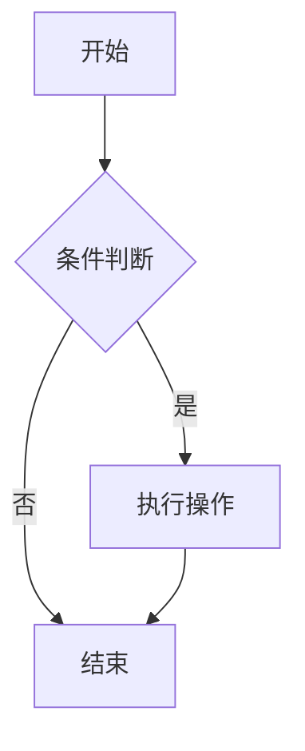

本博客使用 **highlight.js** 在构建时进行代码语法高亮。所有代码块均带有行号、语言标记和复制按钮。

## 多语言支持

支持以下语言的高亮：

### JavaScript / TypeScript

```js
function greet(name) {
  console.log(`Hello, ${name}!`);
}
```

```ts
interface User {
  name: string;
  age: number;
}

const user: User = { name: 'Alice', age: 30 };
```

### Python

```python
def fibonacci(n):
    a, b = 0, 1
    for _ in range(n):
        yield a
        a, b = b, a + b
```

### Bash / Shell

```bash
#!/bin/bash
echo "Hello, World!"
ls -la
```

### CSS

```css
.container {
  display: flex;
  justify-content: center;
  align-items: center;
}
```

### HTML

```html
<!DOCTYPE html>
<html lang="zh-CN">
<head>
  <meta charset="UTF-8">
  <title>示例</title>
</head>
<body>
  <h1>你好，世界</h1>
</body>
</html>
```

### JSON

```json
{
  "name": "RouterKit",
  "version": "1.0.0",
  "dependencies": {
    "react": "^19.0.0"
  }
}
```

### YAML

```yaml
title: 我的文章
published: 2026-01-01
tags:
  - blog
  - tech
```

### SQL

```sql
SELECT u.name, COUNT(p.id) AS post_count
FROM users u
LEFT JOIN posts p ON u.id = p.user_id
GROUP BY u.id
ORDER BY post_count DESC;
```

### Markdown

```markdown
## 标题

这是一段**粗体**和*斜体*文字。

- 列表项 1
- 列表项 2
```

## Diff 差异对比

```diff
- const oldValue = 'deprecated';
+ const newValue = 'modern';

  function handle() {
-   return oldValue;
+   return newValue;
  }
```

## Mermaid 图表



## 代码块特性

每个代码块都自动包含以下功能：

- **行号** — 左侧行号，方便引用
- **语言标记** — 右上角显示语言名称
- **复制按钮** — 悬停时显示，一键复制代码
- **暗色主题适配** — 自动跟随系统主题切换